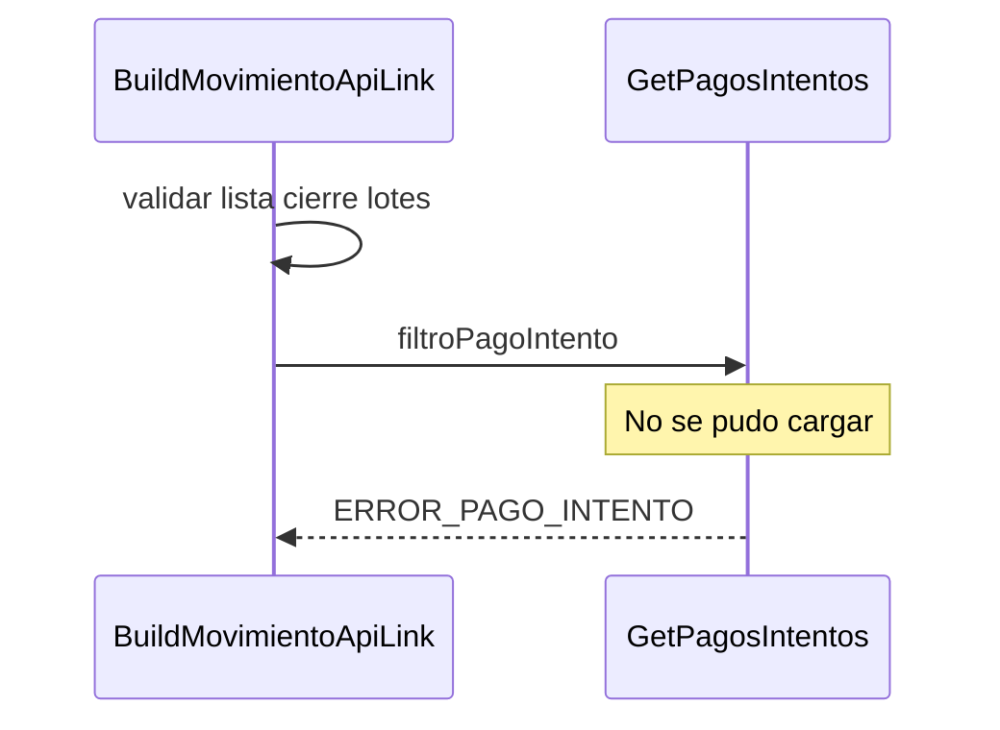

> # Build Movimiento ApiLink

## Error al cargar pagos intentos  
1. Valida si la lista de cierre de lote inicial tiene elementos
2. Busca los pagos intentos que pertenecen a la lista de cierre de lote
3. ERROR_PAGO_INTENTO
***

