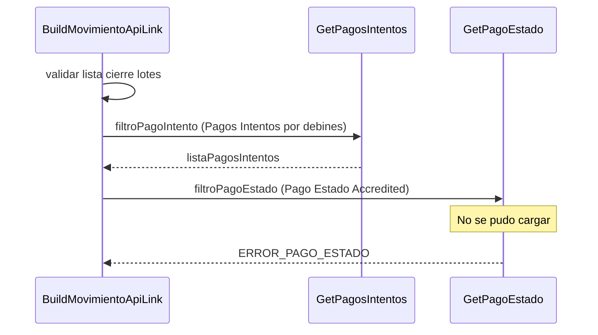

> # Build Movimiento ApiLink

## Error al cargar pago estado Accredited  
1. Valida si la lista de cierre de lote inicial tiene elementos
2. Busca los pagos intentos que pertenecen a la lista de cierre de lote
3. Busca el pago estado Accredited porque para este se irá crear un movimiento
4. ERROR_PAGO_ESTADO
***

