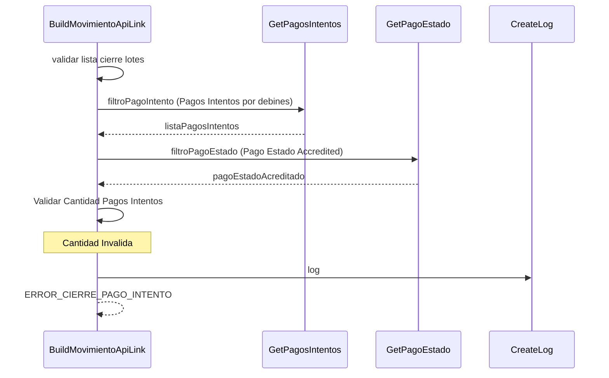

> # Build Movimiento ApiLink

## Error diferencia entre la cantidad de elementos de la lista de cierre de lote y pagos intentos  
1. Valida si la lista de cierre de lote inicial tiene elementos
2. Busca los pagos intentos que pertenecen a la lista de cierre de lote
3. Busca el pago estado Accredited porque para este se irá crear un movimiento
4. Valida si se encontro un pago intento para cada debin en la lista de cierre lote
5. Crea un log para informar la diferencia encontrada
6. ERROR_CIERRE_PAGO_INTENTO
***

