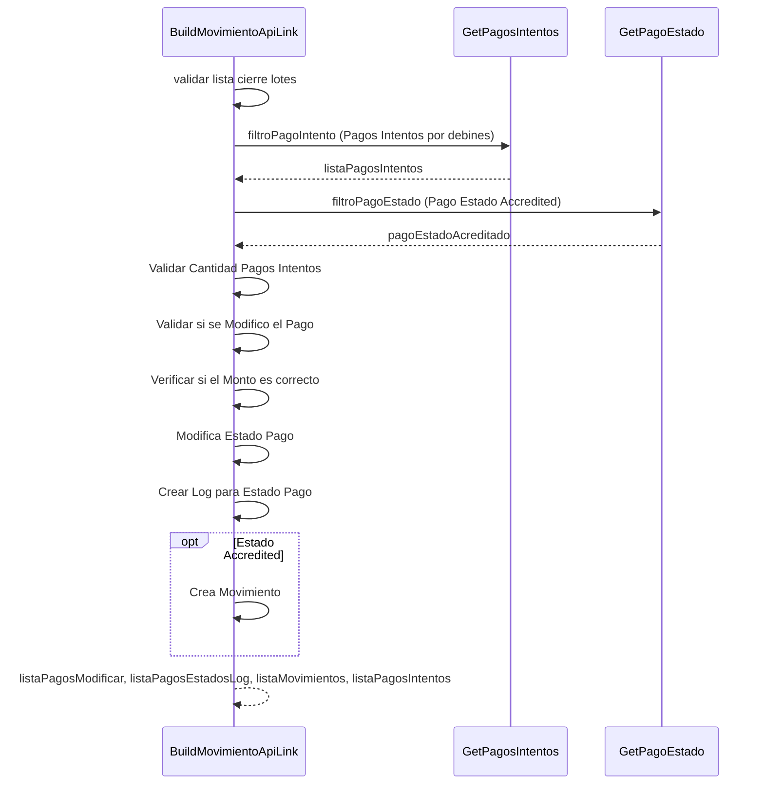

> # Build Movimiento ApiLink

## Genera el movimiento para apilink
1. Valida si la lista de cierre de lote inicial tiene elementos
2. Busca los pagos intentos que pertenecen a la lista de cierre de lote
3. Busca el pago estado Accredited porque para este se irá crear un movimiento
4. Valida si se encontro un pago intento para cada debin en la lista de cierre lote
5. Verifica si el pago tiene un estado diferente de su par en el cierre de lote
6. Valida que el monto del cierre de lote y del pago sean identicos
7. Modifica el estado de cada pago
8. Crear un pago estado log para cada modificación en el pago
9. Verifica si algún cierre de lote tiene el estado Accredited
10. En caso de que el punto 9 es verdadero crea un movimiento.
11. listaPagosModificar, listaPagosEstadosLog, listaMovimientos, listaPagosIntentos
***

