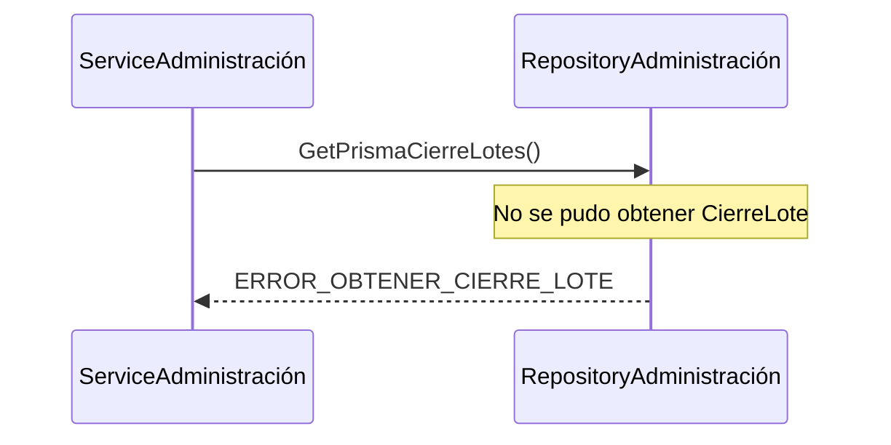
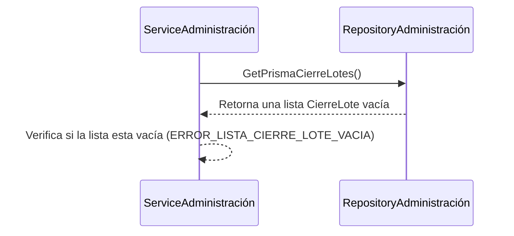

> # Build Prisma Movimiento

## Error al cargar cierre lote (Validar si existe error al intentar obtener el cierre de lote desde la base de datos)
1. intenta obtener los cierre de lotes en DB por medio de la función GetPrismaCierreLotes()
2. ocurre un error, ERROR_OBTENER_CIERRE_LOTE
***

## Error al cargar cierre lote (Validar si la lista de cieere de lote esta vacía)
1. intenta obtener los cierre de lotes en DB por medio de la función GetPrismaCierreLotes()
2. Regresa una una lista vacía
3. Verifica si la lista esta vacía, (listaCL igial a 0), regresa una lista vacía "ERROR_LISTA_CIERRE_LOTE_VACIA"
***
- nota:
       * DB = Data Base
       * listaCL = lista Cierre de Lote

***
