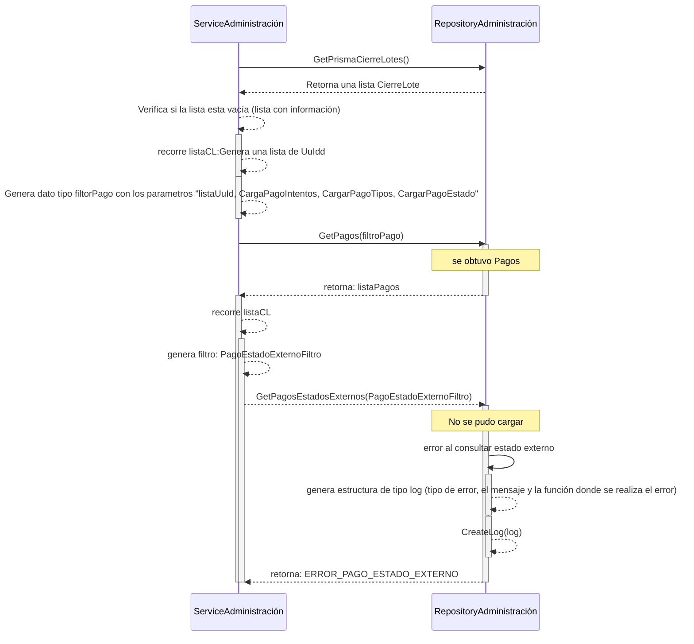

> # Build Prisma Movimiento

## Error al obtener pagos estado externo  (Validar si existe error al intentar obtener el estado externo relacionados con los Cierre de lotes desde la base de datos)
1. Intenta obtener los cierre de lotes en DB por medio de la función GetPrismaCierreLotes()
2. Regresa una lista CierreLote
3. Verifica si la lista esta vacía (listaCL distinto a 0), devuelve lista con información
4. Recorre listaCL y obtiene como resultado una lista de Uuid
5. Genera tipo dato pagofiltro
6. obtener una listaP
7. retorna al sistema listaP
8. recorre listaCL
    - 8.1. genera tipo de dato PagoEstadoExternoFiltro, con los sugiente datos " nombre: tipooperacion"
    - 8.2. intenta obtener informacion del estado externo llamando a la función GetPagosEstadosExternos(PagoEstadoExternoFiltro)
      - 8.2.1. Se produce error, genera estructura de tipo log donde se guarda el tipo de error, el mensaje y la función donde se realiza el error
      - 8.2.2. Inserta en la tabla log información del error, se le pasa como parametro el objeto log que contiene "tipo de error, el mensaje y la función donde se realiza el error"
    - 8.3. retorna error existente, ERROR_PAGO_ESTADO_EXTERNO
9. retorna al sistema el error existente, ERROR_PAGO_ESTADO_EXTERNO
***
- nota:
    * DB = Data Base
    * listaCL = lista Cierre de Lote
    * listaP = lista de Pago
    * PagoFiltro = es una estructura de dato definda que contiene (	Ids []uint64, PagoEstadosId uint64, PagoEstadosIds []uint64, CargaPagoIntentos bool, CargaMedioPagos   bool,	CargarPagoTipos, bool,	CargarCuenta bool,	CargarPagoEstado  bool,	Uuids []string )
    * PagoEstadoExternoFiltro = es una estructura de dato definda que contiene (Vendor string, Nombre string )
    * log = es una entidad
***
