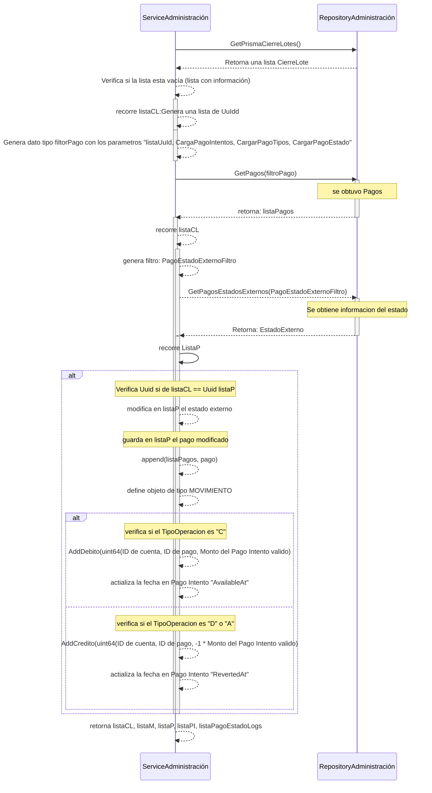

 # Build Prisma Movimiento

## Error al obtener pagos estado externo  (Validar si existe error al intentar obtener el estado externo relacionados con los Cierre de lotes desde la base de datos)
1. Intenta obtener los cierre de lotes en DB por medio de la función GetPrismaCierreLotes()
2. Regresa una lista CierreLote
3. Verifica si la lista esta vacía (listaCL distinto a 0), devuelve lista con información
4. Recorre listaCL y obtiene como resultado una lista de Uuid
5. Genera tipo dato filtro
6. obtener una listaP
7. retorna al sistema listaP
8. recorre listaCL
    - 8.1. genera tipo de dato PagoEstadoExternoFiltro, con los sugiente datos " nombre: tipooperacion"
    - 8.2. intenta obtener informacion del estado externo llamando a la función GetPagosEstadosExternos(PagoEstadoExternoFiltro)
      - 8.2.1. Se obtiene información del estado
    - 8.3. retorna un estado externo
9. recorre listaP
    - 9.1. verifica si el UuId de listaCL es igual al UuId de listaP, si comparacion es verdadera
        - 9.1.1. modifica en listaP el estado externo
        - 9.1.2. guarda en listaP el pago modificado append(listaPagos, pago)
        - 9.1.3. define objeto de tipo MOVIMIENTO movimiento := entities.Movimiento{}
        - 9.1.4. verifica si el TipoOperacion es "C"
            - 9.1.4.1. realiza con MOVIMIENTO la operación AddDebito(uint64(ID de cuenta, ID de pago, Monto del Pago Intento valido) 
            - 9.1.4.2. actializa la fecha en Pago Intento "AvailableAt"
        - 9.1.5. verifica si el TipoOperacion es "D" o "A"
            - 9.1.5.1. realiza con MOVIMIENTO la operación AddCredito(uint64(ID de cuenta, ID de pago, -1 * Monto del Pago Intento valido) 
            - 9.1.5.2. actializa la fecha en Pago Intento "RevertedAt"
10. retorna listaCL, listaM, listaP, listaPI, listaPagoEstadoLogs
***
- nota:
    * DB = Data Base
    * listaCL = lista Cierre de Lote
    * listaP = lista de Pago
    * listaM = lista de Movimientos
    * listaPI = lista de Pagos intentos Validos
    * listaPagoEstadoLogs = Lista de cambios de estados de los pagos
    * PagoFiltro = es una estructura de dato definda que contiene (	Ids []uint64, PagoEstadosId uint64, PagoEstadosIds []uint64, CargaPagoIntentos bool, CargaMedioPagos   bool,	CargarPagoTipos, bool,	CargarCuenta bool,	CargarPagoEstado  bool,	Uuids []string )
    * PagoEstadoExternoFiltro = es una estructura de dato definda que contiene (Vendor string, Nombre string )
***
