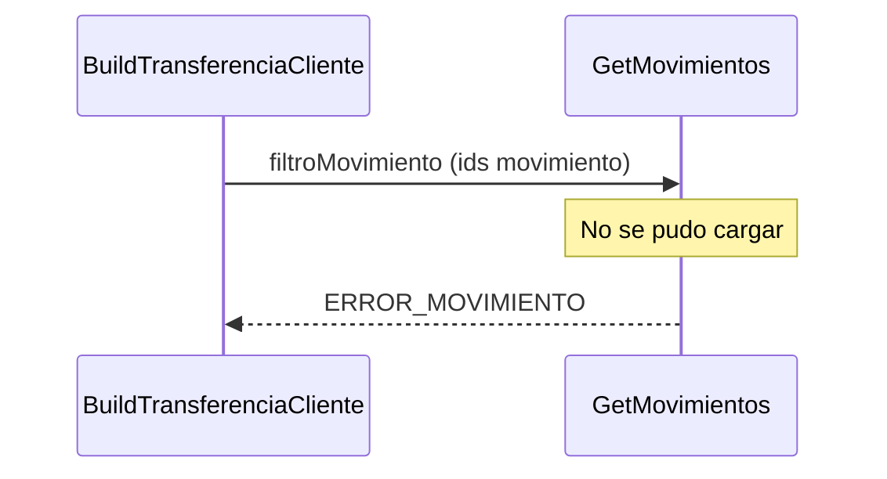

> # Build Transferencia Cliente

## Error al cargar movimientos  
1. Busca una lista de movimientos con los ids seleccionados por el usuario.
2. ERROR_MOVIMIENTO
***

```mermaid
sequenceDiagram;
    participant B as BuildTransferenciaCliente
    participant GM as GetMovimientos
    B ->> GM : filtroMovimiento (ids movimiento)
    Note over GM: No se pudo cargar
    GM -->> B: ERROR_MOVIMIENTO
```

