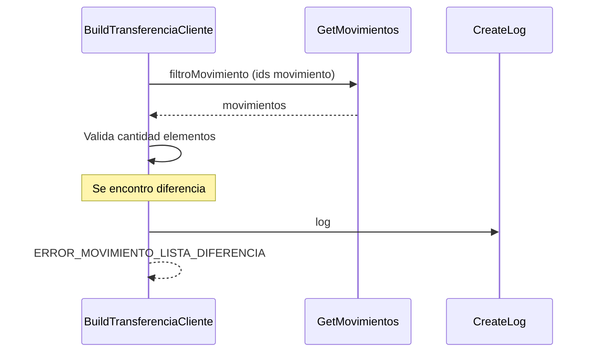

> # Build Transferencia Cliente

## Error en la cantidad de movimentos encontrados  
1. Busca una lista de movimientos con los ids seleccionados por el usuario.
2. Valida si la cantidad de elementos en la lista obtenida es igual a la solicitada por el usuario
3. ERROR_MOVIMIENTO_LISTA_DIFERENCIA
***

