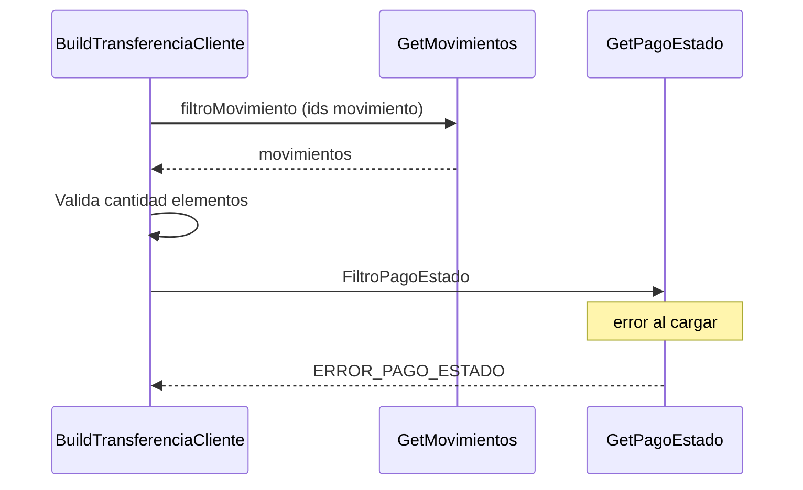

> # Build Transferencia Cliente

## Error al cargar estado acreditado 
1. Busca una lista de movimientos con los ids seleccionados por el usuario.
2. Valida si la cantidad de elementos en la lista obtenida es igual a la solicitada por el usuario
3. Busca el estado Accredited para validar si todos los pagos están en estado acreditado
4. ERROR_PAGO_ESTADO
***

