> # Build Transferencia Cliente

## Error existe pago no acreditado
1. Busca una lista de movimientos con los ids seleccionados por el usuario.
2. Valida si la cantidad de elementos en la lista obtenida es igual a la solicitada por el usuario
3. Busca el estado Accredited para validar si todos los pagos están en estado acreditado
4. Valida si todos los pagos están en estado acreditado
5. Error (muestra el id de movimiento que no está acreditado)
***

```mermaid
sequenceDiagram;
    participant B as BuildTransferenciaCliente
    participant GM as GetMovimientos
    participant GPE as GetPagoEstado
    B ->> GM : filtroMovimiento (ids movimiento)
    GM -->> B: movimientos
    B->>B: Valida cantidad elementos
    B->>GPE: FiltroPagoEstado
    GPE-->>B: estadoAcreditado
    B->>B: Valida Pagos Acreditados
    B-->>B: Error (muestra el id de movimiento que no está acreditado)
```

