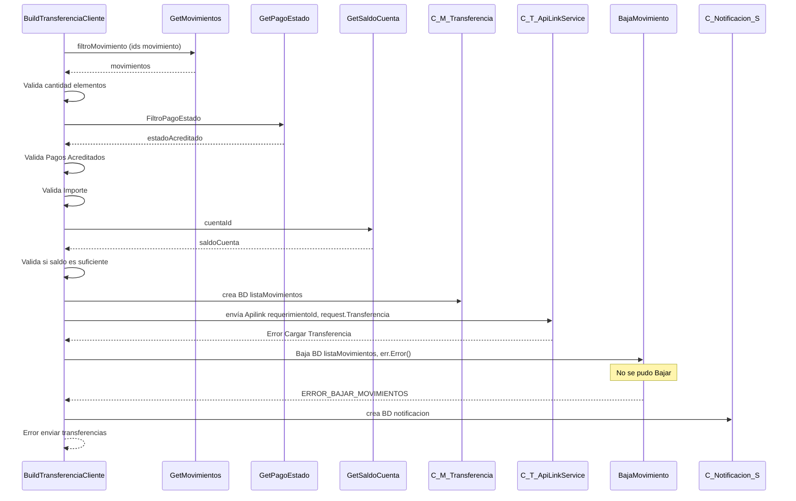

> # Build Transferencia Cliente

## Error al enviar las transferencia a apilink
1. Busca una lista de movimientos con los ids seleccionados por el usuario.
2. Valida si la cantidad de elementos en la lista obtenida es igual a la solicitada por el usuario
3. Busca el estado Accredited para validar si todos los pagos están en estado acreditado
4. Valida si todos los pagos están en estado acreditado
5. Valida si el total solicitado corresponde al todal de los pagos
6. Buscar el saldo de la cuenta del cliente
7. Valida si el saldo de la cuenta es suficiente para realizar la transferencia
8. Crea los movimientos de salida
9. Envía la transferencia para apilink
10. En caso de error baja los movimientos creados anteriormente
11. En caso de error al bajar los movimientos crea una notificacion
12. Error enviar transferencias
***

