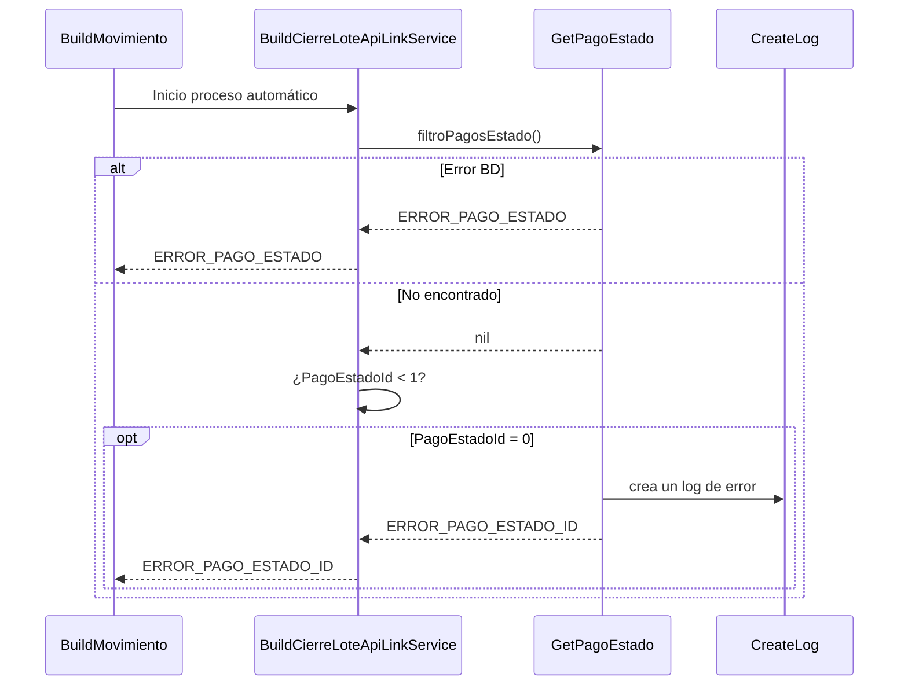

> # Cierre de Lote ApiLink 

## Error al cargar el pago estado
1. Busca el pago estado processing (estado inicial para los debines)
2. ERROR_PAGO_ESTADO_ID | ERROR_PAGO_ESTADO

***

```mermaid
sequenceDiagram;
    participant B as BuildMovimiento
    participant BC as BuildCierreLoteApiLinkService
    participant GPE as GetPagoEstado
    participant L as CreateLog
    B ->> BC : Inicio proceso automático
    BC ->> GPE: filtroPagosEstado()
    alt Error BD
        GPE-->>BC: ERROR_PAGO_ESTADO
        BC-->>B: ERROR_PAGO_ESTADO
    else No encontrado
        GPE-->>BC: nil
        BC ->> BC : ¿PagoEstadoId < 1?
        opt PagoEstadoId = 0
            GPE ->> L: crea un log de error
            GPE -->>BC: ERROR_PAGO_ESTADO_ID
            BC -->>B: ERROR_PAGO_ESTADO_ID
        end
    end
```

