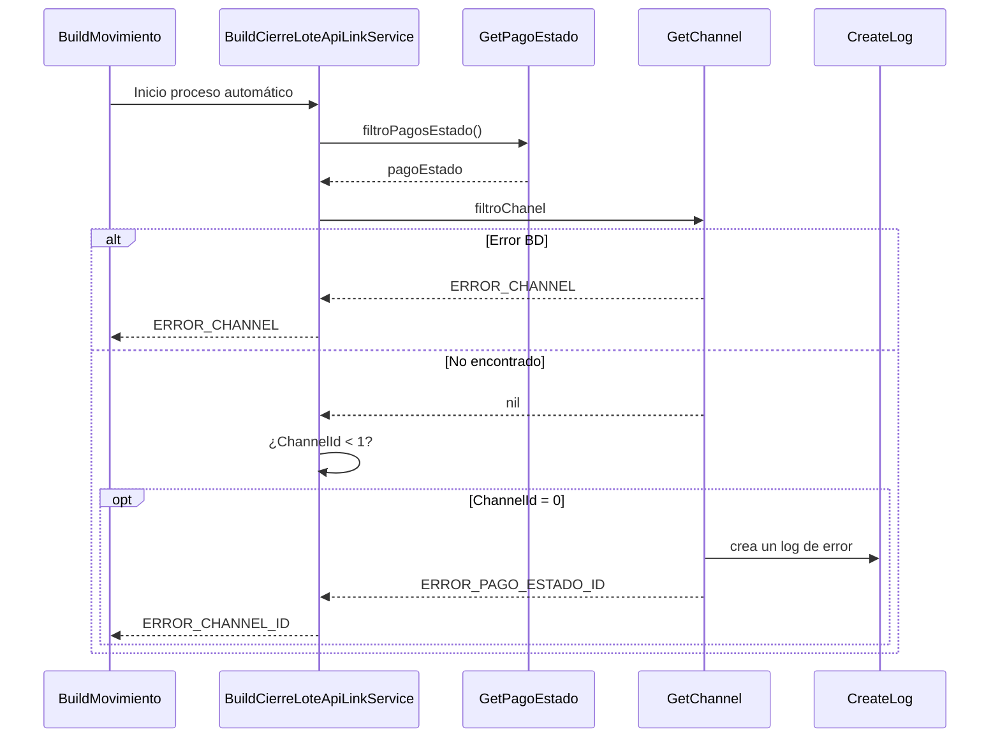

> # Cierre de Lote ApiLink 

## Error al cargar el canal
1. Busca el pago estado processing (estado inicial para los debines)
2. Busca el canal debin 
3. ERROR_CHANNEL | ERROR_CHANNEL_ID

***

```mermaid
sequenceDiagram;
    participant B as BuildMovimiento
    participant BC as BuildCierreLoteApiLinkService
    participant GPE as GetPagoEstado
    participant GC as GetChannel
    participant L as CreateLog
    B ->> BC : Inicio proceso automático
    BC ->> GPE: filtroPagosEstado()
    GPE -->> BC: pagoEstado
    BC ->> GC: filtroChanel
    alt Error BD
        GC-->>BC: ERROR_CHANNEL
        BC-->>B: ERROR_CHANNEL
    else No encontrado
        GC-->>BC: nil
        BC ->> BC : ¿ChannelId < 1?
        opt ChannelId = 0
            GC ->> L: crea un log de error
            GC -->>BC: ERROR_PAGO_ESTADO_ID
            BC -->>B: ERROR_CHANNEL_ID
        end
    end
```

