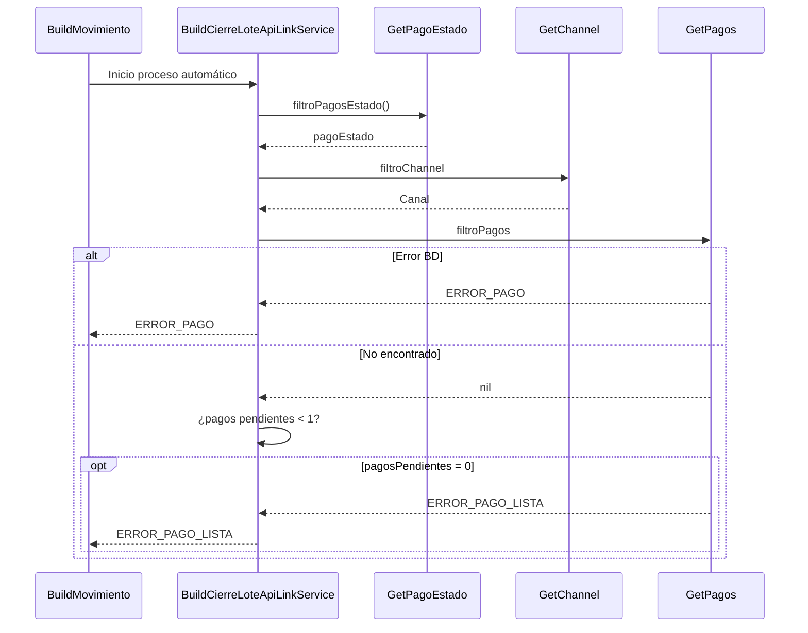

> # Cierre de Lote ApiLink 

## Error al cargar los pagos
1. Busca el pago estado processing (estado inicial para los debines)
2. Busca el canal debin
3. Busco los pagos que pertenecen al pago estado punto 1
4. ERROR_PAGO | ERROR_PAGO_LISTA

***

