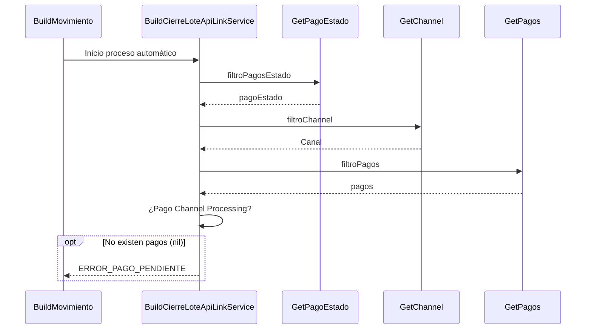

> # Cierre de Lote ApiLink 

## Error al buscar pagos por canal
1. Busca el pago estado processing (estado inicial para los debines) filtroPagosEstado()
2. Busca el canal debin filtroChannel
3. Busco los pagos que pertenecen al pago estado punto 1
4. Filtro los pagos que pertenecen al canl del punto 2
5. ERROR_PAGO_PENDIENTE

***

