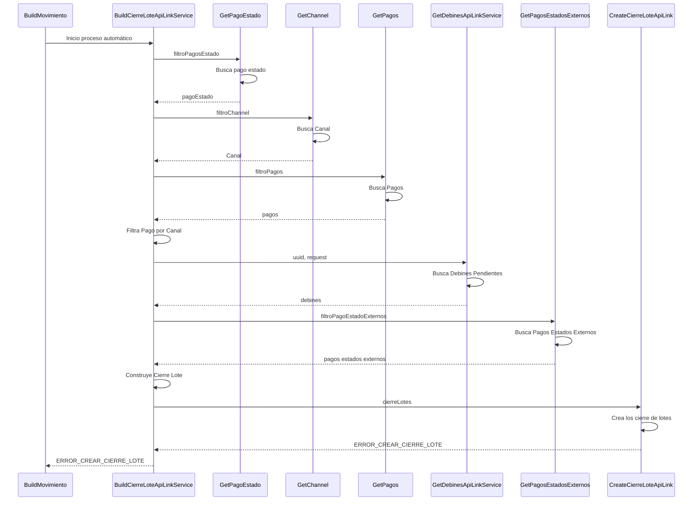

> # Cierre de Lote ApiLink 

## Error al cargar los cierre de lote
1. El proceso se inicia automaticamente en el horario definido
2. Busca el pago estado processing (estado inicial para los debines) filtroPagosEstado()
3. Busca el canal debin filtroChannel
4. Busco los pagos que pertenecen al pago estado punto 1
5. Filtro los pagos que pertenecen al canl del punto 2
6. Busco en apilink todos los pagos que están en estado pendientes y que sean debin
7. Busco los pagos estados externos para poder comparar debines con pagos
8. Crea el cierre de lote a partir de la información de los debines
9. ERROR_CREAR_CIERRE_LOTE

***

