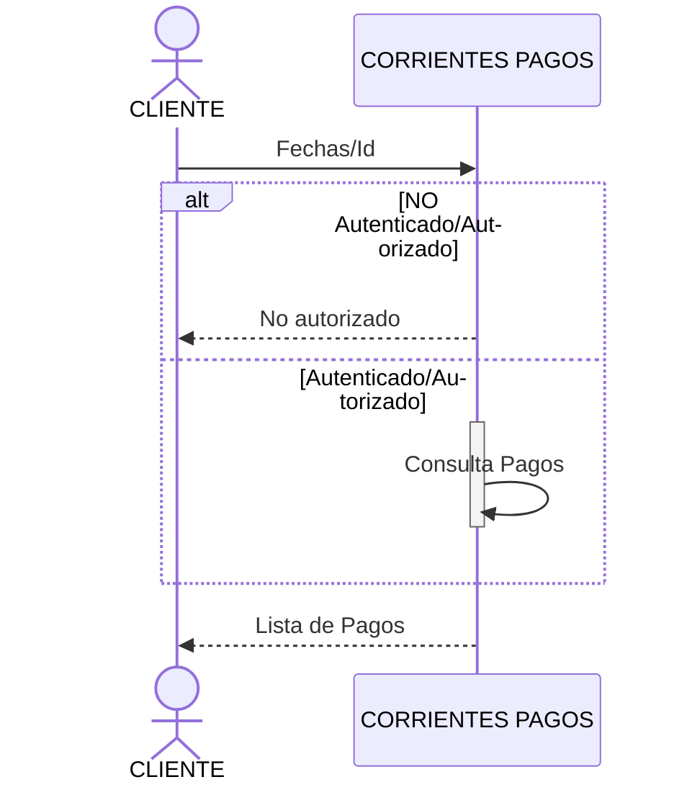

> # Consulta de Pagos
Es un servicio que permite al CLIENTE consultar pagos, pasando un ID único del pago o un periodo de fechas que traerá una colección de pagos. 

***

```mermaid
sequenceDiagram;
    Actor A as CLIENTE
    Participant B as CORRIENTES PAGOS 
    A ->> B : Fechas/Id
    alt NO Autenticado/Autorizado
        B-->> A: No autorizado
    else Autenticado/Autorizado
        activate  B
        B ->> B: Consulta Pagos
        deactivate B
    end
    
    B -->> A: Lista de Pagos
```

