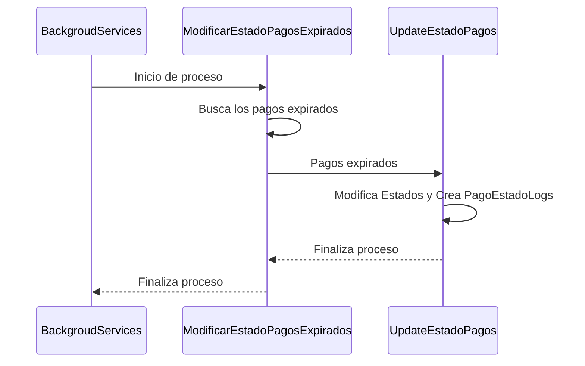

# Pagos que están en estados pendientes deben cambiar de estado en un tiempo definido 

***
> Una vez que el usuario entra en el checkout se genera una pago, este pago queda en estado pendiente al principio. Puede ser que el usuario no siga con el pago, o que el servidor esté con algún problema, o que apilink o prisma tengan problemas para aceptar el pago. En todos estes casos el pago se quedará indefinidamente con el estado pendiente. Para evitar eso al pasar una cantidad de días definida en la tabla de configuraciones **TIEMPO_EXPIRACION_PAGOS** el estado del pago se modificará para expirado.
***

***
> Para eso se implementará una funcionalidad que correrá automaticamente en el período informado en la tabala de configuraciones **PERIODICIDAD_UPDATE_PAGOS_EXPIRADOS**, la cual se encargará de modificar el estado de los pagos pendientes para expirados.
***

[Tarea relacionada PP-141][URL-TAREA]
____

**Esquema Básico**

***

___

# Casos
### Ejecución funcionalidad ModificarEstadoPagosExpirados
- [Error al cargar configuración de tiempo][URL-DOC1]

- [Error al crear configuración][URL-DOC2]

- [Error al buscar el estado pendiente][URL-DOC3]

- [Error al buscar los pagos expirados][URL-DOC4]

- [Caso de succeso no se encontraron pagos expirados][URL-DOC5]

- [Error al cargar el estado expirado][URL-DOC6]

- [Error al modificar los pagos en estado pendientes][URL-DOC7]

- [Caso de succeso][URL-DOC8]
____

# Implementación

- [ModificarEstadoPagosExpirados][URL-SERVICIO]

- [BackgroudServices][URL-BACKGROUND]

- [UpdateEstadoPagos][URL-REPOSITORIO]

- [Prueba Unitaria][URL-PRUEBA]
 

### Lista Tareas

* [X] Análisis de la funcionalidad

* [X] Codificación

* [x] documentación

* [x] Prueba unitaria

[URL-DOC1]:https://github.com/Corrientes-Telecomunicaciones/api_go_pasarela/blob/development/document/administracion/pagospendientesexpirados/01-erro_cargar_conf_tiempo.md
[URL-DOC2]:https://github.com/Corrientes-Telecomunicaciones/api_go_pasarela/blob/development/document/administracion/pagospendientesexpirados/02-error_crear_configuracion.md
[URL-DOC3]:https://github.com/Corrientes-Telecomunicaciones/api_go_pasarela/blob/development/document/administracion/pagospendientesexpirados/03-error_buscar_estado_pendiente.md
[URL-DOC4]:https://github.com/Corrientes-Telecomunicaciones/api_go_pasarela/blob/development/document/administracion/pagospendientesexpirados/04-error_buscar_pagos_expirados.md
[URL-DOC5]:https://github.com/Corrientes-Telecomunicaciones/api_go_pasarela/blob/development/document/administracion/pagospendientesexpirados/05-caso_succeso_no_existen_expirados.md
[URL-DOC6]:https://github.com/Corrientes-Telecomunicaciones/api_go_pasarela/blob/development/document/administracion/pagospendientesexpirados/06-error_buscar_estado_expirado.md
[URL-DOC7]:https://github.com/Corrientes-Telecomunicaciones/api_go_pasarela/blob/development/document/administracion/pagospendientesexpirados/07-error_modificar_estado_pagos.md
[URL-DOC8]:https://github.com/Corrientes-Telecomunicaciones/api_go_pasarela/blob/development/document/administracion/pagospendientesexpirados/08-caso_succeso.md

[URL-PRUEBA]:https://github.com/Corrientes-Telecomunicaciones/api_go_pasarela/blob/development/pkg/domains/administracion/administracion.service_test.go

[URL-SERVICIO]: https://github.com/Corrientes-Telecomunicaciones/api_go_pasarela/blob/development/pkg/domains/administracion/administracion.service.go
[URL-BACKGROUND]: https://github.com/Corrientes-Telecomunicaciones/api_go_pasarela/blob/development/api/background/background_services.go
[URL-REPOSITORIO]: https://github.com/Corrientes-Telecomunicaciones/api_go_pasarela/blob/development/pkg/domains/administracion/administracion.repository.go

[URL-TAREA]: https://telcodev.atlassian.net/secure/RapidBoard.jspa?rapidView=17&projectKey=PP&modal=detail&selectedIssue=PP-141 "Como pasarela debería poder dar de baja en pagos pendientes después de un período de tiempo."