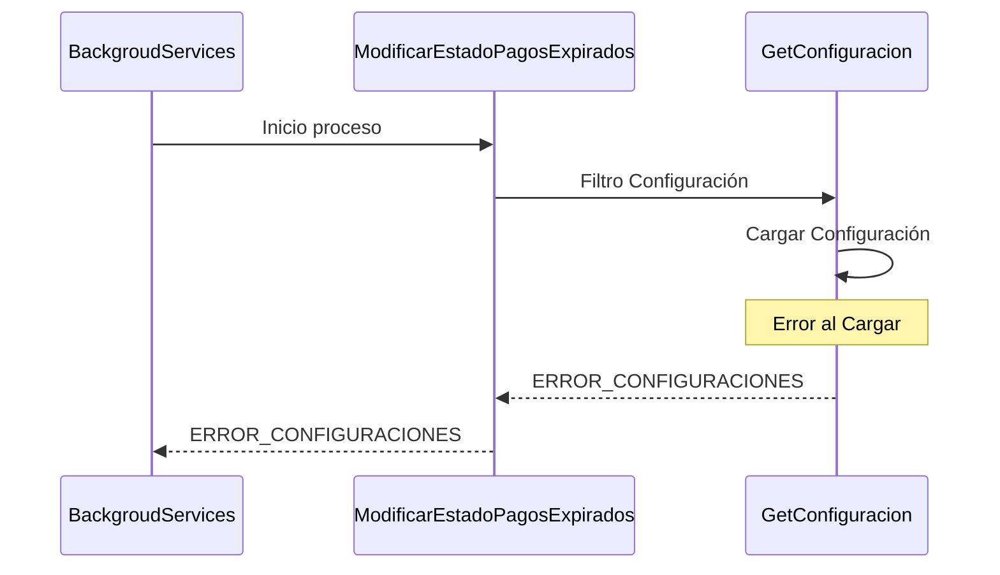

# Pagos pendientes expirados

## Error al cargar configuración de tiempo
1. Busca la configuración TIEMPO_EXPIRACION_PAGOS
2. ERROR_CONFIGURACIONES
***

```mermaid
sequenceDiagram;
    participant BS as BackgroudServices
    participant ME as ModificarEstadoPagosExpirados
    participant GC as GetConfiguracion
    BS ->> ME: Inicio proceso
    ME ->> GC: Filtro Configuración
    GC ->> GC: Cargar Configuración
    Note over GC: Error al Cargar
    GC -->>ME: ERROR_CONFIGURACIONES
    ME -->>BS: ERROR_CONFIGURACIONES
```
