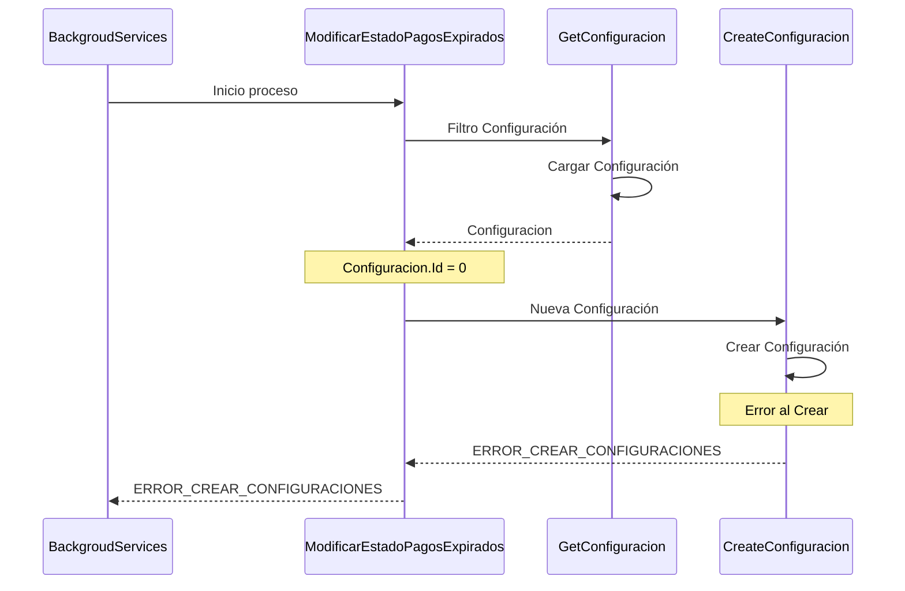

# Pagos pendientes expirados

## Error al crear configuración
1. Busca la configuración TIEMPO_EXPIRACION_PAGOS
2. En caso de que no encuentre la configuración la crea
3. ERROR_CREAR_CONFIGURACIONES
***

