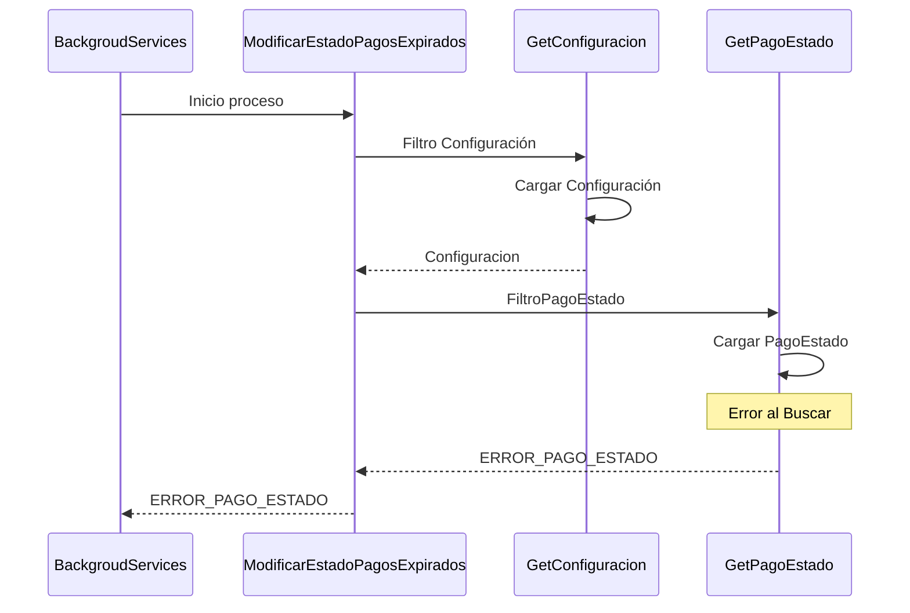

# Pagos pendientes expirados

## Error al buscar el estado pendiente
1. Busca la configuración TIEMPO_EXPIRACION_PAGOS
2. Busca el estado de pago pendiente
3. ERROR_PAGO_ESTADO
***

```mermaid
sequenceDiagram;
    participant BS as BackgroudServices
    participant ME as ModificarEstadoPagosExpirados
    participant GC as GetConfiguracion
    participant GP as GetPagoEstado
    BS ->> ME: Inicio proceso
    ME ->> GC: Filtro Configuración
    GC ->> GC: Cargar Configuración
    GC -->> ME: Configuracion
    ME ->> GP: FiltroPagoEstado
    GP ->> GP: Cargar PagoEstado
    Note over GP: Error al Buscar
    GP -->>ME: ERROR_PAGO_ESTADO
    ME -->>BS: ERROR_PAGO_ESTADO
```
