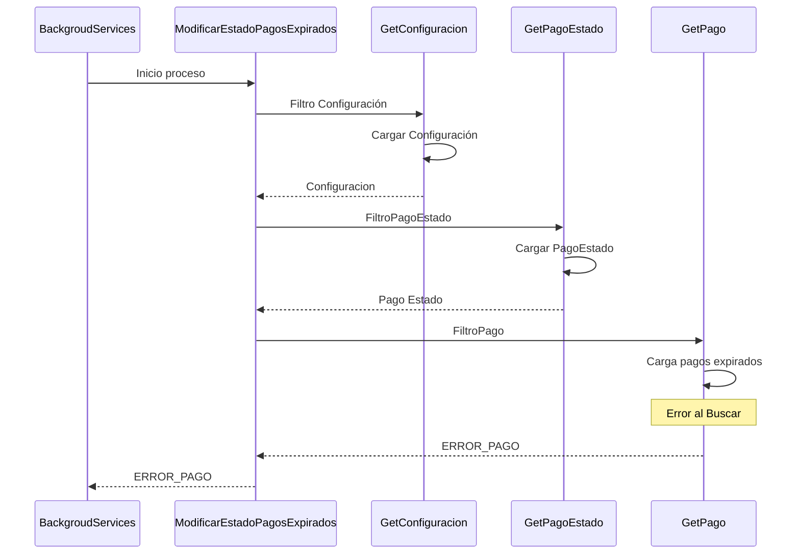

# Pagos pendientes expirados

## Error al buscar los pagos expirados
1. Busca la configuración TIEMPO_EXPIRACION_PAGOS
2. Busca el estado de pago pendiente
3. Busca los pagos expirados
4. ERROR_PAGO
***

