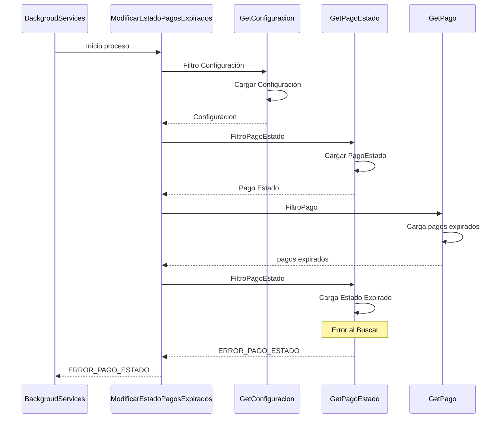

# Pagos pendientes expirados

## Error al cargar el estado expirado
1. Busca la configuración TIEMPO_EXPIRACION_PAGOS
2. Busca el estado de pago pendiente
3. Busca los pagos expirados
4. Busca el estado Expirado
5. ERROR_PAGO_ESTADO
***

