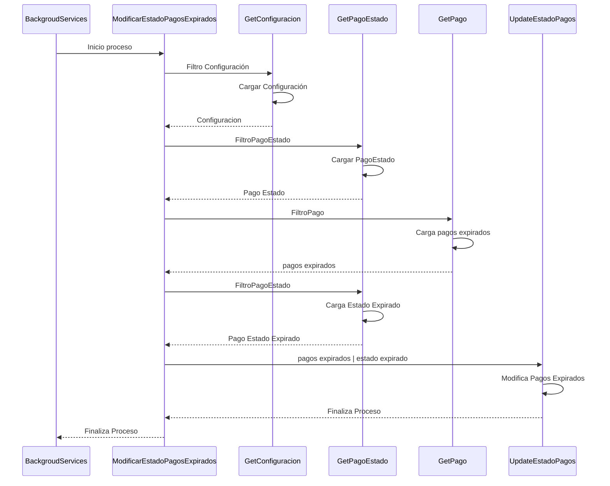

# Pagos pendientes expirados

## Caso de succeso
1. Busca la configuración TIEMPO_EXPIRACION_PAGOS
2. Busca el estado de pago pendiente
3. Busca los pagos expirados
4. Busca el estado Expirado
5. Modifica el estado de los pagos y crea los PagoEstadosLogs
6. Finaliza proceso
***

