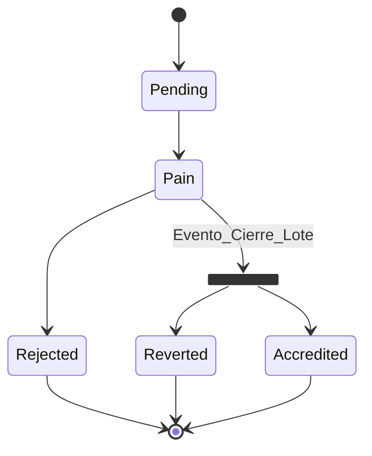

 # Diagrama de Estado
 ## Pago con Tarjeta Crédito/Débito

  stateDiagram-v2
      state fork_state <<fork>>
      state fork_state1 <<fork>>
      state fork_state2 <<fork>>
      [*] --> Pendiente: los pagos CREDITO, DEBITO, OFFLINE y DEBIN
      Pendiente--> fork_state:Evento_check-out
      fork_state-->Procesando:pagos OFFLINE y DEBIN
      fork_state-->Aprobado: pagos CREDITO y DEBITO
      Procesando-->fork_state1
      Aprobado-->fork_state2
      fork_state1-->Caducado:estado final
      fork_state1-->Autorizado:estado final
      fork_state1-->Rechazado:estado final
      fork_state1-->Revertido:estado final
      fork_state2-->Autorizado:estado final
      fork_state2-->Rechazado:estado final
      fork_state2-->Revertido:estado final
      Autorizado-->[*]
      Rechazado-->[*]
      Revertido-->[*]
      %% Caducado-->[*]

## Pago con offline
      stateDiagram-v2
      state fork_state <<fork>>
      state fork_state1 <<fork>>
      [*] --> Pendiente: los pagos CREDITO, DEBITO, OFFLINE y DEBIN
      Pendiente--> fork_state:Evento_check-out
      fork_state-->Procesando:pago OFFLINE
      Procesando-->Aprobado: conciliación de pagos OFFLINE
      Aprobado-->fork_state1
      fork_state1-->Caducado:estado final
      fork_state1-->Autorizado:estado final
      fork_state1-->Rechazado:estado final
      fork_state1-->Revertido:estado final
      Autorizado-->[*]
      Rechazado-->[*]
      Revertido-->[*]
      %% Caducado-->[*]

         stateDiagram-v2
      state fork_state <<fork>>
      [*] --> Pendiente"PENDING": los pagos CREDITO, DEBITO, OFFLINE y DEBIN
      Pendiente"PENDING"--> fork_state:Evento_check-out
      fork_state-->Procesando"PROCESSING":pago OFFLINE
      Procesando"PROCESSING"-->Aprobado"PAID": conciliación de pagos OFFLINE
      Procesando"PROCESSING"-->Caducado"EXPIRED":estado final
      Aprobado"PAID"-->Autorizado"ACCREDITED":estado final
      Aprobado"PAID"-->Caducado"EXPIRED":estado final
      Autorizado"ACCREDITED"-->[*]
      Caducado"EXPIRED"-->[*]

## Pago con debin
  stateDiagram-v2
      state fork_state <<fork>>
      state fork_state1 <<fork>>

      [*] --> Pendiente: los pagos CREDITO, DEBITO, OFFLINE y DEBIN
      Pendiente--> fork_state:Evento_check-out
      fork_state-->Procesando:pagos con DEBIN
      
      Procesando-->fork_state1: conciliación pagos DEBIN

      fork_state1-->Caducado:estado final
      fork_state1-->Autorizado:estado final
      fork_state1-->Rechazado:estado final
      fork_state1-->Revertido:estado final

      Autorizado-->[*]
      Rechazado-->[*]
      Revertido-->[*]
      %% Caducado-->[*]

  ## Pago con Tarjeta de Credito y Debito
stateDiagram-v2
      state fork_state <<fork>>
      state fork_state2 <<fork>>
      [*] --> Pendiente"PENDING": los pagos CREDITO, DEBITO, OFFLINE y DEBIN
      Pendiente"PENDING"--> fork_state:Evento_check-out
      fork_state-->Aprobado"PAID": pagos CREDITO y DEBITO
      Aprobado"PAID"-->fork_state2: conciliación pagos con Tarjeta CREDITO y DEBITO
      fork_state2-->Autorizado"ACCREDITED":estado final
      fork_state2-->Rechazado"REJECTED":estado final
      fork_state2-->Revertido"REVERTED":estado final
      Autorizado"ACCREDITED"-->[*]
      Rechazado"REJECTED"-->[*]
      Revertido"REVERTED"-->[*]
      %% Caducado-->[*]