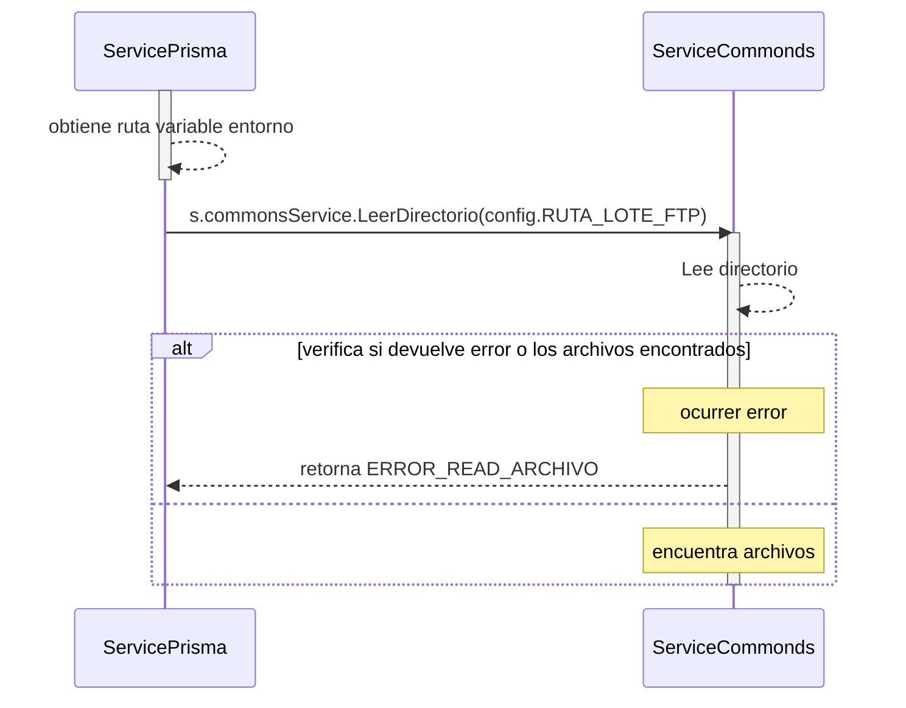

# Servicio Archivo Lote Externo

## Error al a leer la ruta directorio recibida 
### (se le pasa un directorio e intenta leer los archivos que se encuentran en el directorio)
- BC: BackGround
- SP: Servico Prisma
- SCom: Servicio Commons
1. diariamente despues de la media noche BC llama al servicio SP funcion ArchivoLoteExterno() (err error)
2. obtiene de las variable de entorno la ruta donde se localizan los archivos de cierre de lote
3. se llama al servicio SCom y se le pasa el valor de la ruta s.commonsService.LeerDirectorio(config.RUTA_LOTE_FTP) 
4. verifica si devuelve error o los archivos encontrados, retorna error 
5. retorna ERROR_READ_ARCHIVO
***

***
[Volver][URL-Volver]

[URL-Volver]: https://github.com/Corrientes-Telecomunicaciones/api_go_pasarela/blob/development/document/prisma/cierreloteprisma/01-servicio_archivo_Lote_externo.md