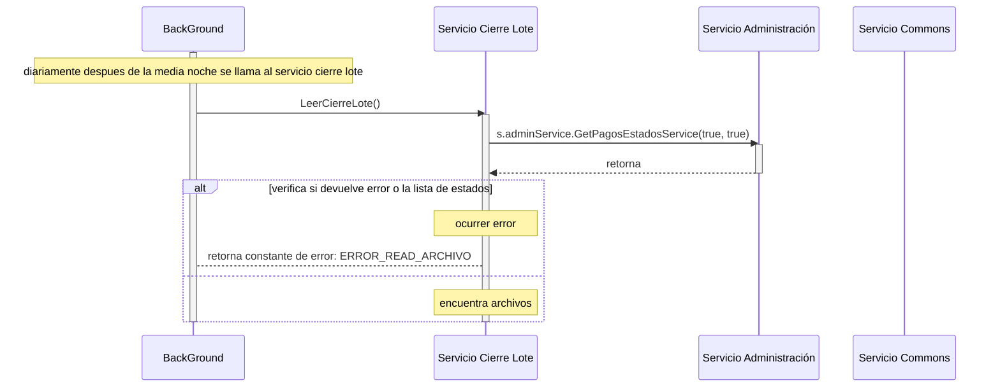

# Servicio Leer Cierre Lote

## Error al obtener lista de estados desde la base  de datos 

### (se consulta la base de datos para obtener una lista de estados)
- BC: BackGround
- SCL: Servico Cierre de Lote
- SAdmin: Servicio Administración
- SCom: Servicio Commons
1. diariamente despues de la media noche BC llama al servicio cierre lote LeerCierreLote()
2. se llama al servicio SAdmin  s.adminService.GetPagosEstadosService(true, true) para obtener una lista de estados
3. verifica si devuelve error o la lista de estados, retorna error 
4. retorna constante de error: ERROR_READ_ARCHIVO

***

***
[Volver][URL-Volver]

[URL-Volver]: https://github.com/Corrientes-Telecomunicaciones/api_go_pasarela/blob/development/document/prisma/cierreloteprisma/01-servicio_leer_cierre_lote_prisma.md
