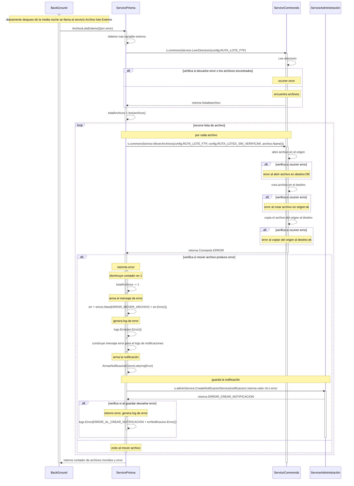

# Servicio Archivo Lote Externo

## Error al mover archivos 
### (luego de obtener una lista de archivo, estos son movidos de un directorio origen a un directorio destino)

- SP: Servico Prisma
- SCom: Servicio Commons
- SAdmin: Servicio Administración
1. diariamente despues de la media noche BC llama al servicio SP funcion ArchivoLoteExterno() (err error)
1. obtiene de las variable de entorno la ruta donde se localizan los archivos de cierre de lote
2. se llama al servicio SCom y se le pasa el valor de la ruta s.commonsService.LeerDirectorio(config.RUTA_LOTE_FTP) 
3. verifica si devuelve error o los archivos encontrados, retorna lista_de_archivo 
4. retorna lista_de_archivo
5. define contador con total de archivos entcontrados, totalArchivos = len(archivos) 
6. recorre lista de archivos, por cada archivo 
7. llama servico SCom, s.commonsService.MoverArchivos(config.RUTA_LOTE_FTP, config.RUTA_LOTES_SIN_VERIFICAR, archivo.Name()) retorna valor nil o error
8. verifica si se produce error, retornta error
9. disminuye contador en 1, totalArchivos -= 1    
10. arma el mensaje de error, err = errors.New(ERROR_MOVER_ARCHIVO + err.Error()) 
11. genera log de error, logs.Error(err.Error())
12. construye msaje error para el logs de notificaciones
13. arma la notificación, ArmarNotificacionCierreLote(msjError)
14. llama al servico SAdmin para guarda la notificación s.adminService.CreateNotificacionService(notificacion) retorna valor nil o error
15. verifica si al guardar devuelve error, retorno error
16. genera log de error, logs.Error(ERROR_AL_CREAR_NOTIFICACION + errNotificacion.Error())
17. retorna contador de archivos movidos y error

***

***
[Volver][URL-Volver]

[URL-Volver]: https://github.com/Corrientes-Telecomunicaciones/api_go_pasarela/blob/development/document/prisma/cierreloteprisma/01-servicio_archivo_Lote_externo.md

