```mermaid
sequenceDiagram;
    participant bc as BackGround
    participant scl as Servicio Cierre Lote
    participant sa as Servicio Administración
    participant sc as Servicio Commons
    activate bc
        note over bc: diariamente despues de la media noche se llama al servicio cierre lote
        bc->>scl: LeerCierreLote()
        activate scl
            scl ->> sa: s.adminService.GetPagosEstadosService(true, true)
            activate sa
                sa-->>scl: retorna repuesta
            deactivate sa
            alt verifica si devuelve error o la lista de estados
                Note over scl: ocurrer error
            else
                Note over scl: encuentra archivos
                scl-->bc: retorna una lista con los estados
            end
            activate scl
                scl-->>scl: define una constante que representa un tamaño de bufer
            deactivate scl
            scl->>sc:s.commonsService.LeerDirectorio(config.RUTA_LOTES_SIN_VERIFICAR) retorna error o lista de archivos
            activate sc
                sc-->>scl: retorna ERROR_READ_ARCHIVO
            deactivate sc
            scl-->>bc: retorna ERROR_READ_ARCHIVO
        deactivate scl
    deactivate bc
```

# Servicio Leer Cierre Lote

## Error al directorios de cierre de lotes 

### (se intenta leer el directorio y obtener los archivos de cierre de lotes)
- BC: BackGround
- SCL: Servico Cierre de Lote
- SAdmin: Servicio Administración
- SCom: Servicio Commons
1. diariamente despues de la media noche BC llama al servicio cierre lote LeerCierreLote()
2. se llama al servicio SAdmin  s.adminService.GetPagosEstadosService(true, true) para obtener una lista de estados
3. verifica si devuelve error o la lista de estados, retorna lista de estados 
4. retorna una lista con los estados
5. define una constante que representa un tamaño de bufer
6. llama al servicio SCom para obtener los archivos de cierre de lotes, s.commonsService.LeerDirectorio(config.RUTA_LOTES_SIN_VERIFICAR) retorna error o lista de archivos, retornta Error
7. retorna ERROR_READ_ARCHIVO
8. retorna ERROR_READ_ARCHIVO

***

***
[Volver][URL-Volver]

[URL-Volver]: https://github.com/Corrientes-Telecomunicaciones/api_go_pasarela/blob/development/document/prisma/cierreloteprisma/01-servicio_leer_cierre_lote_prisma.md