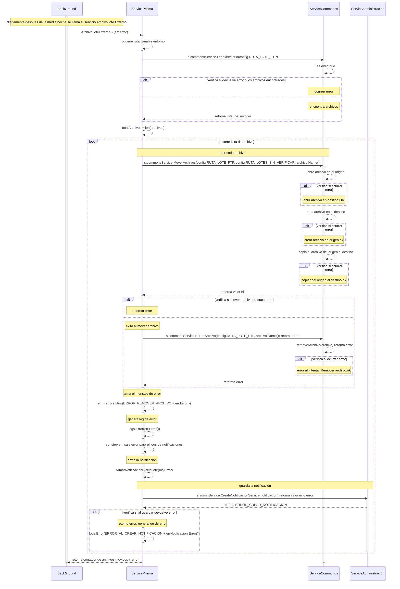

# Servicio Archivo Lote Externo

## Error al intentar remover un archivo
### (luego de mover un archivo desde una ubicación origen a una ubicacion destino con exito, el archivo de la ubicacion origen es borrado)
- SP: Servico Prisma
- SCom: Servicio Commons
- SAdmin: Servicio Administración
1. diariamente despues de la media noche BC llama al servicio SP funcion ArchivoLoteExterno() (err error)
1. obtiene de las variable de entorno la ruta donde se localizan los archivos de cierre de lote
2. se llama al servicio SCom y se le pasa el valor de la ruta s.commonsService.LeerDirectorio(config.RUTA_LOTE_FTP) 
3. verifica si devuelve error o los archivos encontrados, retorna lista_de_archivo 
4. retorna lista_de_archivo
5. define contador con total de archivos entcontrados, totalArchivos = len(archivos) 
6. recorre lista de archivos, por cada archivo 
7. llama servico SCom, s.commonsService.MoverArchivos(config.RUTA_LOTE_FTP, config.RUTA_LOTES_SIN_VERIFICAR, archivo.Name()) retorna valor nil o error
8. verifica si mover archivo produce error, retornta nil
9. la funcion retorna un valor nil al realizar el movimiento de archivo con exito
10. llama servico SCom s.commonsService.BorrarArchivo(config.RUTA_LOTE_FTP, archivo.Name()) retorna valor nil o error
11. verifica si al borrar archivo se produce error, retornta error
12. arma el mensaje de error, err = errors.New(ERROR_REMOVER_ARCHIVO + err.Error()) 
13. genera log de error, logs.Error(err.Error())
14. construye msaje error para el logs de notificaciones
15. arma la notificación, ArmarNotificacionCierreLote(msjError)
16. llama al servico SAdmin para guarda la notificación s.adminService.CreateNotificacionService(notificacion) retorna valor nil o error
17. verifica si al guardar devuelve error, retorno error
18. genera log de error, logs.Error(ERROR_AL_CREAR_NOTIFICACION + errNotificacion.Error())
19. retorna contador de archivos movidos y error

***
## posible constantes de ERRROR que se puede recibir mover un archivo
    - ERROR_REMOVER_ARCHIVO
    - ERROR_CREAR_NOTIFICACION
***

***
[Volver][URL-Volver]

[URL-Volver]: https://github.com/Corrientes-Telecomunicaciones/api_go_pasarela/blob/development/document/prisma/cierreloteprisma/01-servicio_archivo_Lote_externo.md

