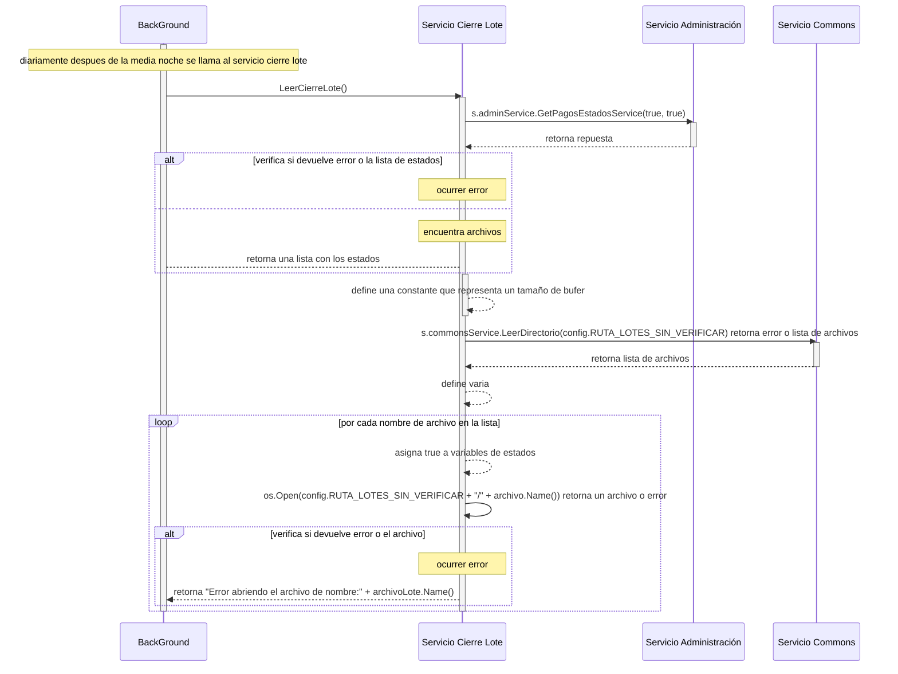

# Servicio Leer Cierre Lote

## Error al abrir archivo de cierre de lote

### (se lee el contenido del archivo)
- BC: BackGround
- SCL: Servico Cierre de Lote
- SAdmin: Servicio Administración
- SCom: Servicio Commons
1. diariamente despues de la media noche BC llama al servicio cierre lote LeerCierreLote()
2. se llama al servicio SAdmin  s.adminService.GetPagosEstadosService(true, true) para obtener una lista de estados
3. verifica si devuelve error o la lista de estados, retorna lista de estados 
4. retorna una lista con los estados
5. define una constante que representa un tamaño de bufer
6. llama al servicio SCom para obtener los archivos de cierre de lotes, s.commonsService.LeerDirectorio(config.RUTA_LOTES_SIN_VERIFICAR) retorna error o lista de archivos, retornta lista de archivos
7. retorna lista de archivos
8. define variables de estados
9. por cada nombre de archivo en la lista
10. asigna true a variables de estados
10. se intenta abrir el archivo llamando a os.Open(config.RUTA_LOTES_SIN_VERIFICAR + "/" + archivo.Name()) retorna un archivo o error
11. verifica si devuelve error o el archivo, retorna error
12. retorna "Error abriendo el archivo de nombre:" + archivoLote.Name()
13. retorna error

***

***
[Volver][URL-Volver]

[URL-Volver]: https://github.com/Corrientes-Telecomunicaciones/api_go_pasarela/blob/development/document/prisma/cierreloteprisma/01-servicio_leer_cierre_lote_prisma.md