```mermaid
sequenceDiagram;
    participant bc as BackGround
    participant scl as Servicio Cierre Lote
    participant sa as Servicio Administración
    participant sc as Servicio Commons
    participant rp as RepositorioPrisma
    activate bc
        note over bc: diariamente despues de la media noche se llama al servicio cierre lote
        bc->>scl: LeerCierreLote()
        activate scl
            scl ->> sa: s.adminService.GetPagosEstadosService(true, true)
            activate sa
                sa-->>scl: retorna repuesta
            deactivate sa
            alt verifica si devuelve error o la lista de estados
                Note over scl: ocurrer error
            else
                Note over scl: encuentra archivos
                scl-->bc: retorna una lista con los estados
            end
            activate scl
                scl-->>scl: define una constante que representa un tamaño de bufer
            deactivate scl
            scl->>sc:s.commonsService.LeerDirectorio(config.RUTA_LOTES_SIN_VERIFICAR) retorna error o lista de archivos
            activate sc
                sc-->>scl: retorna lista de archivos
            deactivate sc
            scl-->>scl: define varia
            loop por cada nombre de archivo en la lista
                scl-->>scl: asigna true a variables de estados
                scl->>scl: os.Open(config.RUTA_LOTES_SIN_VERIFICAR + "/" + archivo.Name()) retorna un archivo o error
                alt verifica si devuelve error
                    Note over scl: ocurrer error
                end
                Note over scl: encuentra archivo
                activate scl
                Note over scl: llama la función
                    scl-->>scl: RecorrerArchivo(archivoLote, TamanioBufer) retornar error o lista detalle de cierre lote, retorna listaDetalleCierreLote
                deactivate scl
                    activate scl
                        scl-->>scl: cambia el valor de las variables de estados a true
                    deactivate scl
                alt verificar si retorna error
                    Note over scl: ocurre error                    
                else
                    note over scl: retorna listaDetalleCierreLote
                    activate scl
                        note over scl: llama a la funcion 
                        scl-->>scl: CrearListaCierreLote(estadosPago, archivo.Name(), registroDetalle) retorna ListaCierreLote
                    deactivate scl
                    alt verifica si retorna error, retorna ListaCierreLote
                        Note over scl: ocurre error
                    end
                    activate scl
                        note over scl,rp: guarda el cierre de lote
                        scl->>rp: s.repository.SaveCierreLoteBatch(listaCierreLote) retorna error o Booleno true, retorna true
                        activate rp
                            rp-->>scl: retorna booleano true
                        deactivate rp
                        alt verifica retorna error, retorna true
                            note over scl: ocurre error
                        end
                        scl-->>scl: cambia el valor de las variables de estados a true
                    deactivate scl
                    activate scl
                        Note over scl: agrega los estados y regresa abrir el siguente archivo
                        scl-->>scl: prismaCierreLote.PrismaLogArchivoResponse({ datos de la estructura})
                    deactivate scl  
                end
                note over scl: finaliza recorrido de lista de archivos
            end
            Note over scl: recorre ListaArchivo generada en el loop aterior
            loop por acada elemento de la lista de archivo
                alt verifica los estado de archivoLeido y archivoLoteInsert si son verdaderos
                    Note over scl: estados verdaderos
                    Note over scl,sc: llama al servicio SCom para mover los archivos
                    scl->>sc:  s.commonsService.MoverArchivos(config.RUTA_LOTES_SIN_VERIFICAR, config.RUTA_LOTES_VERIFICADOS, archivo.NombreArchivo) retorna nil o error
                    activate sc
                        sc-->>scl: retorna error
                    deactivate sc
                    alt verfica si retorna error, retorna error
                        activate scl
                            scl-->>scl: genera logs de error, logs.Error(ERROR_MOVER_ARCHIVO + err.Error())
                        deactivate scl
                        activate scl
                            Note over scl: modifica es estado de la variable ArchivoMovido false
                            scl-->>scl: listaArchivo[key].ArchivoMovido = false
                        deactivate scl                        
                    end
                end
                alt verifica si agunos de los estados de las variables ArchivoLeido, ArchivoMovido y LoteInsert son false
                    Note over scl: algunos de las variables de estados son falso
                    activate scl
                        Note over scl: arma notificacion  
                        scl-->>scl: ArmarNotificacion(archivo)
                    deactivate scl
                        Note over scl, sa: llama al servicio SAdmin para guardar la notificiacion  
                        scl-->>sa: s.adminService.CreateNotificacionService(notificacion) retorna error o nil 
                    activate sa
                        sa-->>scl: retorna erro
                    deactivate sa
                    alt verifica si retorna error
                        Note over scl: retorna error
                        activate scl
                            scl-->>scl: genera logs de error, logs.Error(ERROR_AL_CREAR_NOTIFICACION + err.Error())
                        deactivate scl
                    end
                end 
            end
            Note over bc, scl: finaliza recocrido
            scl-->>bc: retorna ListaArchivo
        deactivate scl
    deactivate bc
```

# Servicio Leer Cierre Lote

## Exito al recorrer el contenido del archivo

### (se lee el contenido del archivo de cierre de lote con exito y se guarda la informacion)
- BC: BackGround
- SCL: Servico Cierre de Lote
- SAdmin: Servicio Administración
- SCom: Servicio Commons
1. diariamente despues de la media noche BC llama al servicio cierre lote LeerCierreLote()
2. se llama al servicio SAdmin  s.adminService.GetPagosEstadosService(true, true) para obtener una lista de estados
3. verifica si devuelve error o la lista de estados, retorna lista de estados 
4. retorna una lista con los estados
5. define una constante que representa un tamaño de bufer
6. llama al servicio SCom para obtener los archivos de cierre de lotes, s.commonsService.LeerDirectorio(config.RUTA_LOTES_SIN_VERIFICAR) retorna error o lista de archivos, retornta lista de archivos
7. retorna lista de archivos
8. define variables de estados
9. por cada nombre de archivo en la lista
10. se intenta abrir el archivo llamando a os.Open(config.RUTA_LOTES_SIN_VERIFICAR + "/" + archivo.Name()) retorna un archivo o error
11. verifica si devuelve error o el archivo, retorna un archivo
12. llama a la funcion RecorrerArchivo(archivoLote, TamanioBufer) puede retornar error o lista detalle de cierre lote, retorna error
13. verifca se retorno error o lista de detalle de cierre lote, retorna listaDetalleCierreLote
14. llama a la funcion CrearListaCierreLote(estadosPago, archivo.Name(), registroDetalle) retorna error o ListaCierreLote, retorna ListaCierreLote
15. verifica retorna error, retorna ListaCierreLote
16. guarda el cierre de lote s.repository.SaveCierreLoteBatch(listaCierreLote) retorna error o un valor Booleno true, retorna true
17. verifica retorna error, retorna true
18. cambia el valor de las variables de estados a true
19. agrega los estados de los errores ocurrido y regresa abrir el siguente archivo, listaArchivo = append(listaArchivo, prismaCierreLote.PrismaLogArchivoResponse{ NombreArchivo: archivo.Name(), ArchivoLeido: estado, ArchivoMovido: false, LoteInsert: estadoInsert, ErrorProducido: ErrorProducido,})
18. finaliza recorrido de lista de archivos
19. recorre ListaArchivo, por acada elemento de la lista de archivo
20. verifica los estado de archivoLeido y archivoLoteInsert son verdaderos, si son verdaderos
21. llama al servicio SCom para mover los archivos s.commonsService.MoverArchivos(config.RUTA_LOTES_SIN_VERIFICAR, config.RUTA_LOTES_VERIFICADOS, archivo.NombreArchivo) retorna nil o error, si retorna error
22. verfica si retorna error, retorna error
22. genera logs de error, logs.Error(ERROR_MOVER_ARCHIVO + err.Error())
23. modifica es estado de la variable ArchivoMovido false, listaArchivo[key].ArchivoMovido = false
24. verifica se retorna nil, retrona nil
25. modifica es estado de la variable ArchivoMovido true, listaArchivo[key].ArchivoMovido = true
26. llama al servicio SCom para borrar el archivo s.commonsService.BorrarArchivo(config.RUTA_LOTES_SIN_VERIFICAR, archivo.NombreArchivo) retorna nil o error, si retorna error
27. verifica si retorna error, retorna error
28. genera logs de error, logs.Error(err1.Error())
29. verifica si los estados de las variables ArchivoLeido, ArchivoMovido y LoteInsert son false, si son false
30. arma notificacion  ArmarNotificacion(archivo)
31. llama al servicio SAdmin para guardar la notificiacion s.adminService.CreateNotificacionService(notificacion) retorna error o nil, retorna error
32. verifica si retorna error, retorna error
33. genera logs de error, logs.Error(ERROR_AL_CREAR_NOTIFICACION + err.Error())
24. finaliza recorrido de listaArchivo
35. retorna listaArchivo
***

***
[Volver][URL-Volver]

[URL-Volver]: https://github.com/Corrientes-Telecomunicaciones/api_go_pasarela/blob/development/document/prisma/cierreloteprisma/01-servicio_archivo_Lote_externo.md

