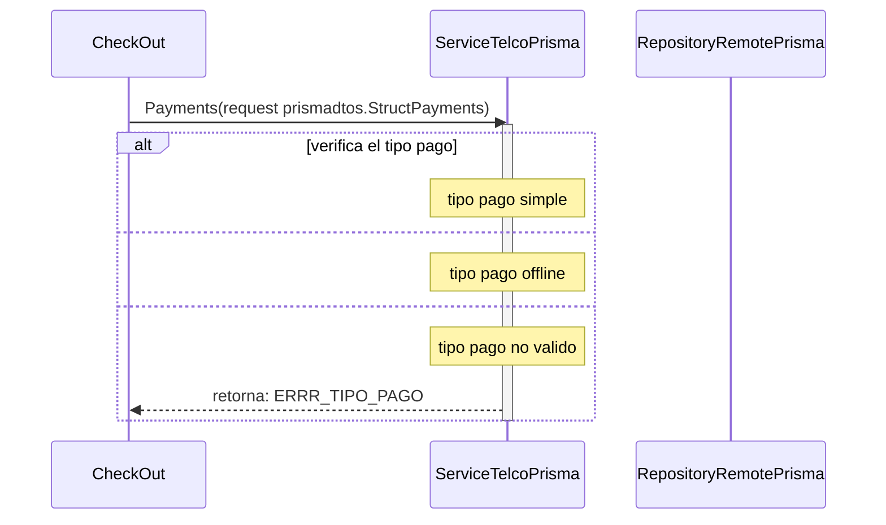

# ejecucion de pago simple y offline

***
## Error al solicitar la ejecucion de pago(el tipo de pago enviado no es valido)
1. solicita ejecucion de pago Payments(request prismadtos.StructPayments)
2. verifica el tipo de pago 
3. retorna ERRR_TIPO_PAGO
***

***
[Volver][URL-Volver]

[URL-Volver]: https://github.com/Corrientes-Telecomunicaciones/api_go_pasarela/blob/development/document/prisma/ejecuciondepago/00-ejecucion_de_pago.md