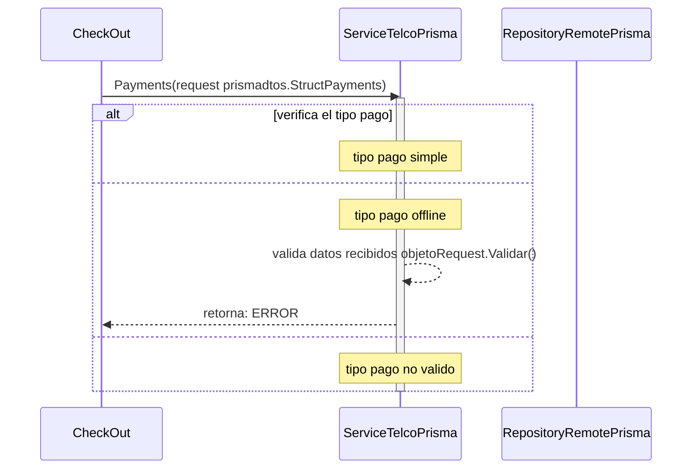

# ejecucion de pago simple y offline

***
## Error al validar la estructura de dato recibida (para ejecucion de pago offline)
1. solicita ejecucion de pago Payments(request prismadtos.StructPayments)
2. verifica el tipo de pago "si es tipo pago offline"
3. valida datos recibidos objetoRequest.Validar()
4. retorna ERRROR
## posible constantes de ERRROR que se puede recibir al validar los datos para una ejecucion de pago offline
    - ERROR_TIPO_DOCUMENTO
    - ERROR_NRO_DOC
    - ERROR_NOMBRE_PAGADOR
    - ERROR_SITE_TRANSACTION_ID
    - ERROR_TOKEN_PAGO
    - ERROR_AMOUNT
    - ERROR_EMAIL
    - ERROR_CODP3
    - ERROR_CODP4
    - ERROR_CLIENTE_NRO
    - ERROR_SURCHANGE
    - ERROR_MODO_PAGO
***

***

[Volver][URL-Volver]

[URL-Volver]: https://github.com/Corrientes-Telecomunicaciones/api_go_pasarela/blob/development/document/prisma/ejecuciondepago/00-ejecucion_de_pago.md