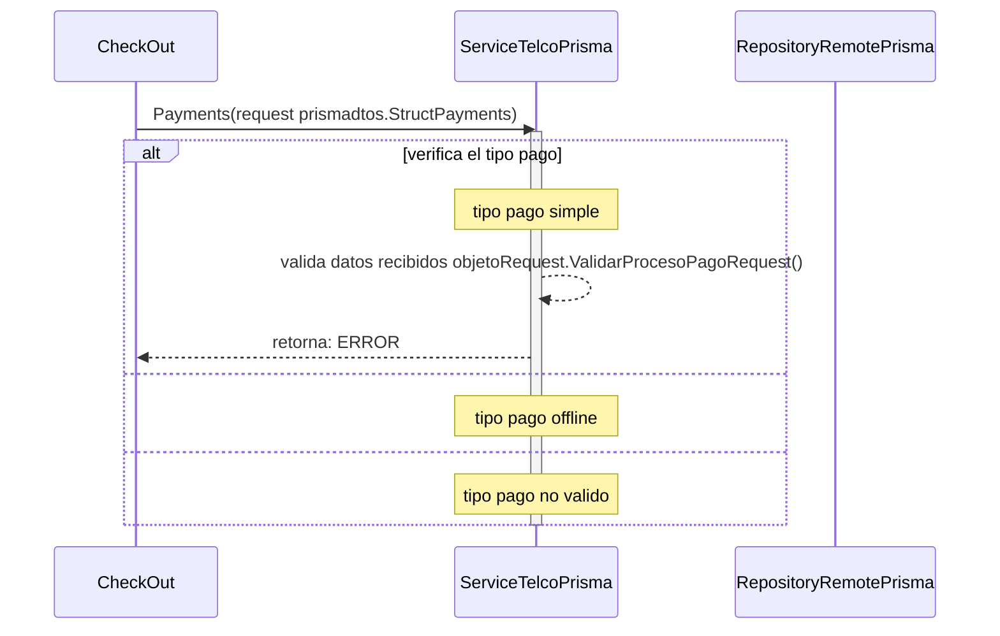

# ejecucion de pago simple y offline

***
## Error al validar la estructura de dato recibida (para ejecucion de pago simble)
1. solicita ejecucion de pago Payments(request prismadtos.StructPayments)
2. verifica el tipo de pago "si es tipo pago simple"
3. valida datos recibidos objetoRequest.ValidarProcesoPagoRequest()
4. retorna ERRROR

## posible constantes de ERRROR que se puede recibir al validar los datos para una ejecucion de pago simple
    - ERROR_SITE_TRANSACTION_ID
    - ERROR_TOKEN_PAGO
    - ERROR_BIN
    - ERROR_AMOUNT
    - ERROR_INSTALLMENTS
    - ERROR_PAYMENT_TYPE
    - ERROR_NOMBRE_ESTABLECIMIENTO
    - ERROR_EMAIL
***

***
[Volver][URL-Volver]

[URL-Volver]: https://github.com/Corrientes-Telecomunicaciones/api_go_pasarela/blob/development/document/prisma/ejecuciondepago/00-ejecucion_de_pago.md