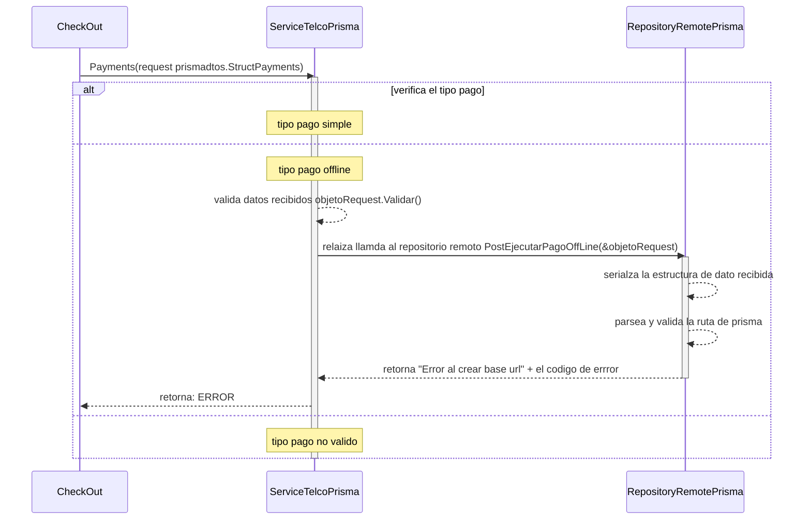

# ejecucion de pago simple y offline

***
## Error al parsear y validar URL (para relaizar una llamada al servicio de prisma)
1. solicita ejecucion de pago Payments(request prismadtos.StructPayments)
2. verifica el tipo de pago "si es tipo pago offline"
3. valida datos recibidos objetoRequest.Validar()
4. relaiza llamda al repositorio remoto PostEjecutarPagoOffLine(&objetoRequest)
5. serializa la estructura de dato recibida
6. parsea y valida la ruta de prisma 
7. retorna "Error al crear base url" + el codigo de errror
***

***
[Volver][URL-Volver]

[URL-Volver]: https://github.com/Corrientes-Telecomunicaciones/api_go_pasarela/blob/development/document/prisma/ejecuciondepago/00-ejecucion_de_pago.md