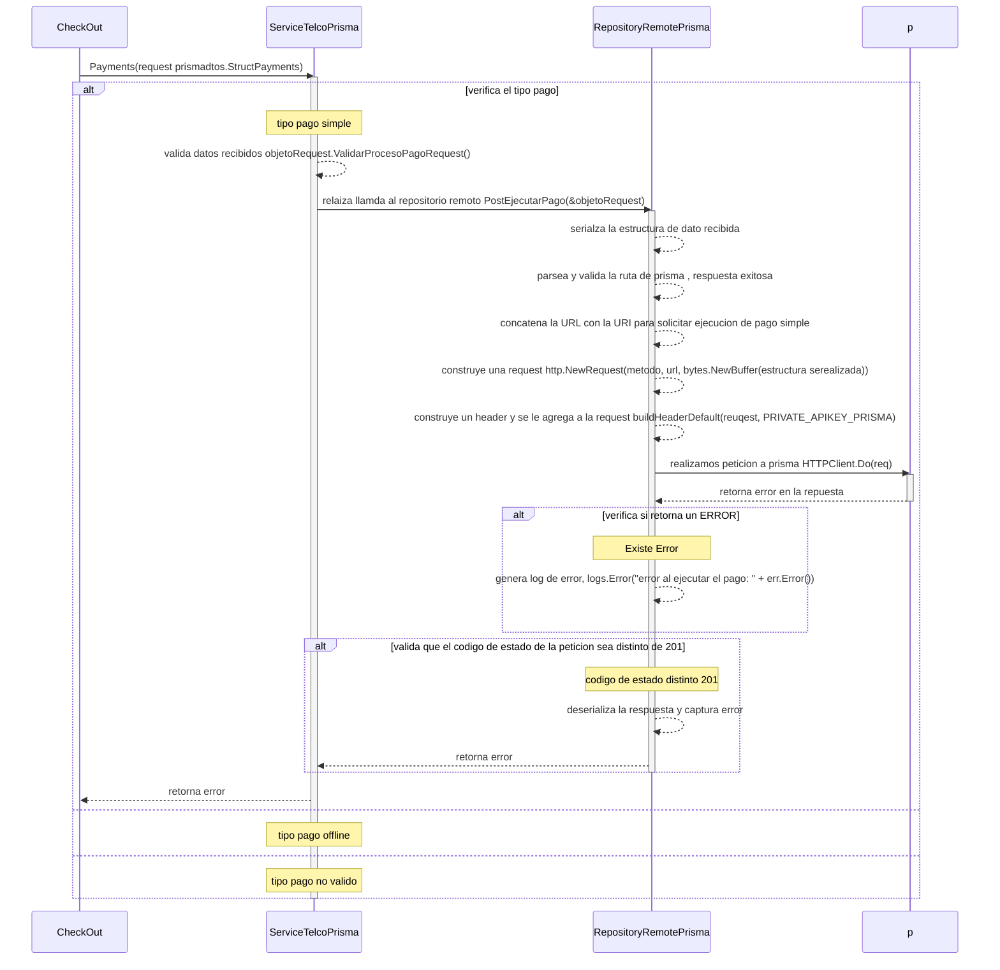

# ejecucion de pago simple y offline

***
## Error en peticion ejecucion de pago simple (para relaizar una llamada al servicio de prisma)
1. solicita ejecucion de pago Payments(request prismadtos.StructPayments)
2. verifica el tipo de pago "si es tipo pago simple"
3. valida datos recibidos objetoRequest.ValidarProcesoPagoRequest()
4. relaiza llamda al repositorio remoto PostEjecutarPago(&objetoRequest)
5. serializa la estructura de dato recibida
6. parsea y valida la ruta de prisma , respuesta exitosa 
7. concatena la URL con la URI para solicitar ejecucion de pago simple
8. construye una request http.NewRequest(metodo, url, bytes.NewBuffer(estructura serealizada))
9. construye un header y se le agrega a la request buildHeaderDefault(reuqest, PRIVATE_APIKEY_PRISMA)
10. realizamos peticion a prisma HTTPClient.Do(req): retorna ERROR
11. verifica si retorna un ERROR
    - 11.1. genera log de error, logs.Error("error al ejecutar el pago: " + err.Error())
12. cerrar la conexion, defer resp.Body.Close()
13. valida que el codigo de estado de la peticion sea distinto de 201: si es distinto a 201
    - 13.1. deserializa la respuesta y captura el error
    - 13.2. al servicio, retorna ERROR
14. al checkout, retorna ERROR 
***

***
[Volver][URL-Volver]

[URL-Volver]: https://github.com/Corrientes-Telecomunicaciones/api_go_pasarela/blob/development/document/prisma/ejecuciondepago/00-ejecucion_de_pago.md