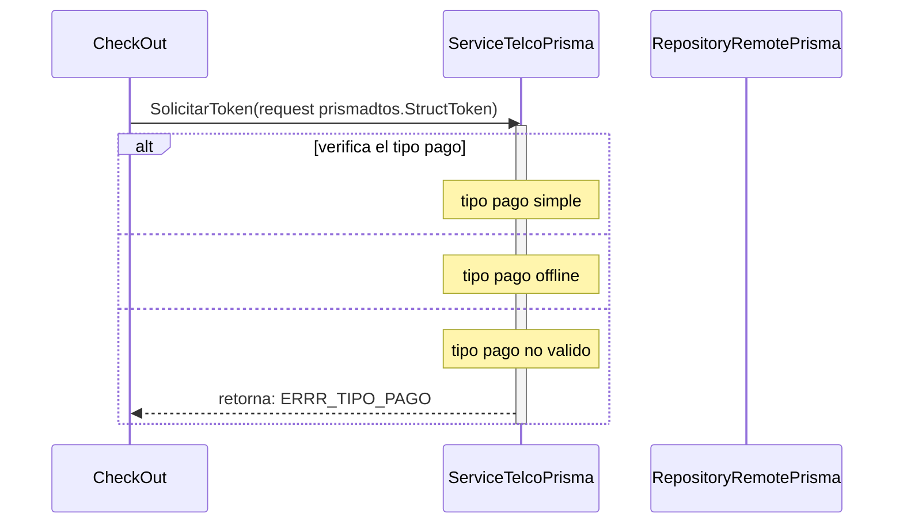

# solicitud token pago simple y offline

***
## Error al solicitar permiso de pago(el tipo de pago enviado no es valodo)
1. solicita un permiso de pago SolicitarToken(request prismadtos.StructToken)
2. verifica el tipo de pago 
3. retorna ERRR_TIPO_PAGO
***

***
[Volver][URL-Volver]

[URL-Volver]: https://github.com/Corrientes-Telecomunicaciones/api_go_pasarela/blob/development/document/prisma/solicitudtoken/00-solicitud_permiso_de_pago.md