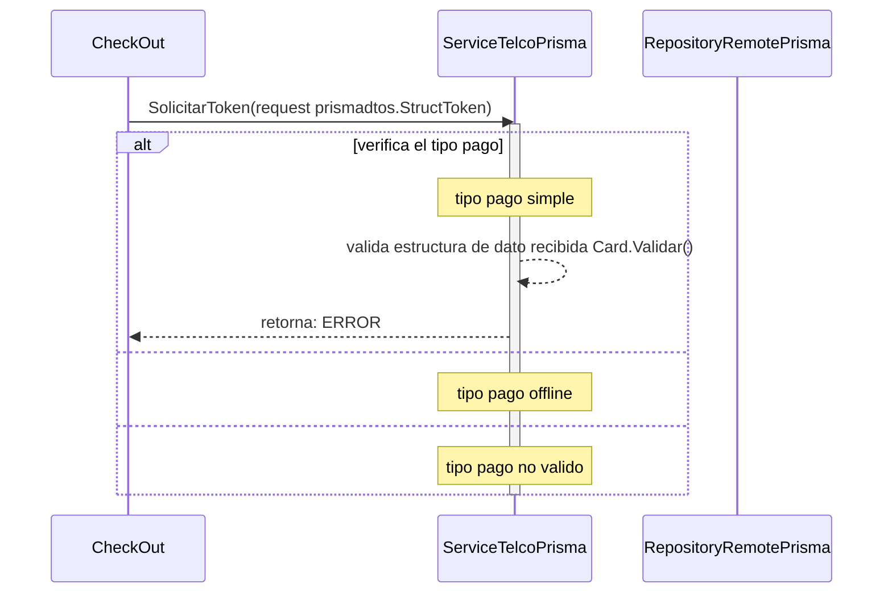

# solicitud token pago simple y offline

***
## Error al validar la estructura de dato recibida (para un pago simble)
1. solicita un permiso de pago SolicitarToken(request prismadtos.StructToken)
2. verifica el tipo de pago simple
3. valida datos recibidos
4. retorna ERRROR
***
## posible constantes de ERRROR que se puede recibir al validar los datos para una solicitud de pago simple
    - ERROR_ESTRUCTURA_INCORRECTA
    - ERROR_NUMBER_CARD
    - ERROR_NUMBER_CARD
    - ERROR_DATE_CARD
    - ERROR_DATE_CARD
    - ERROR_HOLDER_NAME
    - ERROR_TIPO_DOCUMENTO
***

[Volver][URL-Volver]

[URL-Volver]: https://github.com/Corrientes-Telecomunicaciones/api_go_pasarela/blob/development/document/prisma/solicitudtoken/00-solicitud_permiso_de_pago.md