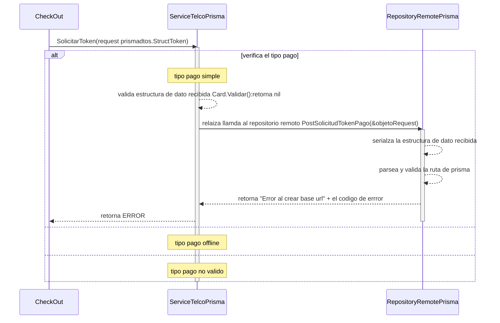

# solicitud token pago simple y offline

***
## Error al parsear y validar URL (para relaizar una llamada al servicio de prisma)
1. solicita un permiso de pago SolicitarToken(request prismadtos.StructToken)
2. verifica el tipo de pago simple
3. valida datos recibidos
4. relaiza llamda al repositorio remoto PostSolicitudTokenPago(&objetoRequest)
5. serializa la estructura de dato recibida
6. parsea y valida la ruta de prisma 
7. retorna "Error al crear base url" + el codigo de errror
***

[Volver][URL-Volver]

[URL-Volver]: https://github.com/Corrientes-Telecomunicaciones/api_go_pasarela/blob/development/document/prisma/solicitudtoken/00-solicitud_permiso_de_pago.md