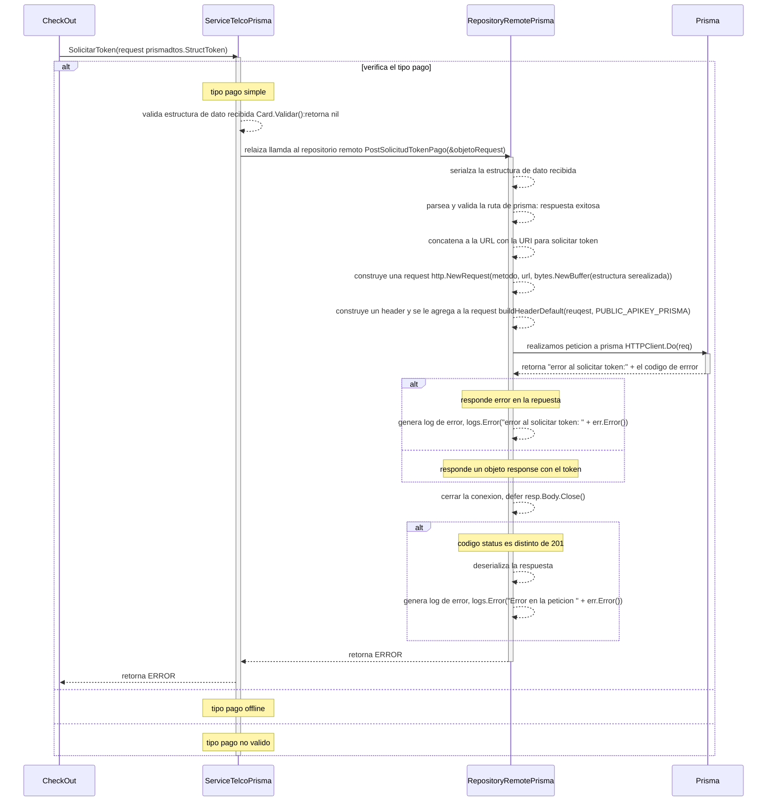

# solicitud token pago simple y offline

***
## Error al solicitar una peticion de token a prisma (prisma devuelve un error en la respuesta)
1. solicita un permiso de pago SolicitarToken(request prismadtos.StructToken)
2. verifica el tipo de pago simple
3. valida datos recibidos
5. relaiza llamda al repositorio remoto PostSolicitudTokenPago(&objetoRequest)
6. serializa la estructura de dato recibida
7. parsea y valida la ruta de prisma, respuesta exitosa 
8. concatena a la URL con la URI para solicitar token
9. construye una request http.NewRequest(metodo, url, bytes.NewBuffer(estructura serealizada))
10. construye un header y se le agrega a la request buildHeaderDefault(reuqest, PUBLIC_APIKEY_PRISMA)
11. realizamos peticion a prisma HTTPClient.Do(req): retorna ERROR
12. verifica si retorna un ERROR
    - 12.1. genera log de error, logs.Error("error al solicitar token: " + err.Error())
13. cerrar la conexion, defer resp.Body.Close()
14. se valida el codigo sea distinto a 201, si es distinto
    - 14.1. deserializa la respuesta 
    - 14.2. genera log de error, logs.Error("Error en la peticion " + err.Error())
15. al servicio, retorna ERROR 
16. al checkout, retorna ERROR 
***

[Volver][URL-Volver]

[URL-Volver]: https://github.com/Corrientes-Telecomunicaciones/api_go_pasarela/blob/development/document/prisma/solicitudtoken/00-solicitud_permiso_de_pago.md